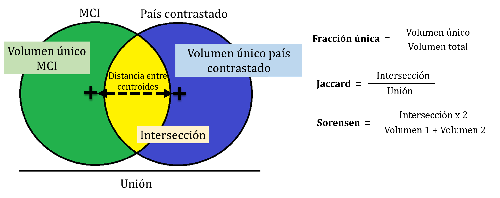

```{r setup, include=FALSE}
knitr::opts_chunk$set(echo = TRUE)
options(Encoding="UTF-8")
options(tikzDefaultEngine = "xetex")
library(knitr)
hook_output <- knit_hooks$get("output")
knit_hooks$set(output = function(x, options) {
  lines <- options$output.lines
  if (is.null(lines)) {
    return(hook_output(x, options))  # pass to default hook
  }
  x <- unlist(strsplit(x, "\n"))
  more <- "..."
  if (length(lines)==1) {        # first n lines
    if (length(x) > lines) {
      # truncate the output, but add ....
      x <- c(head(x, lines), more)
    }
  } else {
    x <- c(more, x[lines], more)
  }
  # paste these lines together
  x <- paste(c(x, ""), collapse = "\n")
  hook_output(x, options)
})
```

# Especies invasoras - Un problema global {.tabset}
El crecimiento poblacional y la industrialización han llevado al hombre a ocupar prácticamente todos los biomas, impactando gravemente en la diversidad de los sistemas naturales. La biodiversidad es esencial para el mantenimiento de las funciones y servicios ecosistémicos, de los cuales nos beneficiamos, pero a la vez son indispensables para el mantenimiento de la homeóstasis terrestre (@Cardinale2012). Los esfuerzos para la conservación de estas funciones han llevado a analizar las causas de pérdida de la biodiversidad, siendo las especies invasoras la segunda mayor amenaza a la biodiversidad, después de la pérdida de hábitat (@SIMBERLOFF2013). Para luchar contra esta causa necesitamos políticas de gestión efectivas, pero el esfuerzo de erradicación aumenta con el tiempo de invasión, y por este motivo es imprescindible tratar de trabajar en la previsión y primeras fases de invasión (@VanWilgen2014).
Según la Unión Internacional para la Conservación de la naturaleza (UICN), las especies invasoras son:

>“Especie exótica invasora”: especie exótica que se establece en un ecosistema o hábitat natural o seminatural; es un agente de cambio y amenaza la diversidad biológica nativa. (UICN, 2000)

##¿Por qué son invasoras?
Existen diversas hipótesis que tratan de explicar los motivos por los cuales algunas especies se convierten en invasoras. La hipótesis mayoritaria es que la falta de enemigos naturales en el nuevo hábitat dónde la invasora llega, le permite crecer sin control invirtiendo menos en compuestos y estrategias defensivas. Esta es la *Enemy Release Hypothesis*(@Catford200922).

Otros autores postulan la regla del 10. De diez especies exóticas que llegan a un nuevo terreno, una se convierte en invasora. Esta hipótesis se basa en el azar y el hecho de que algunas comunidades son mas fáciles de ser invadidas que otras (@Richardson2006409).

Una tercera corriente postula que hay ciertos rasgos que proporcionan a las especies invasoras mayores posibilidades para serlo. Por ejemplo, grandes inversiones en dispersión de semillas, ciclos de vida cortos o crecimiento clonal son algunos de los rasgos propuestos, como los que definen a un "buen invasor"(@VanKleunen2010947).

Ninguna de estas hipótesis és excluyente, por lo que los factores determinantes del éxito invasor podría ser una combinación de aspectos de las tres corrientes(@Catford200922). 

Pese a la divergencia de hipótesis que explican la expansión de las especies invasoras, encontramos una mayor unificación con respecto a las teorias que explican el establecimiento de las especies fuera de su rango nativo. No todas las especies pueden ser encontradas en todos los hàbitats. Cada especie tiene sus requerimientos y por lo tanto es posible definir su nicho ecológico en base a las condiciones donde una especie puede vivir, crecer y reproducirse (@Grinnell1917). El nicho de una especie se define como una región (un hipervolumen de n dimensiones) en un espacio multidimensional basado en factores ambientales que afectan al bienestar de la especie (Hutchinson 1957). La similitud climatica entre diferentes paises podria ser clave para entender el establecimiento de las especies fuera de su rango nativo y una herramienta muy util para la valoración del riesgo invasor. Un mejor conocimiento de los factores que determinan si una especie podría convertirse en invasora, sería vital para las políticas de conservación de la biodiversidad, pues la prevención es la acción más económica para erradicar una especie invasora (@Kumschick20131095). Saber hasta qué punto la similitud con el marco climático de una región, en nuestro caso la Península Íbérica, puede favorecer a la invasión biológica nos puede permitir definir medidas de prevención mayores.


# Objetivos del trabajo y definiciones iniciales {.tabset}

## Objetivos

El objetivo principal de este trabajo es utilizar diferentes herramientas de gestión y analisis de datos para valorar el riesgo invasor en la Península Ibérica, en base a la hipótesis de la similitud climatica como principal factor determinante para el establecimiento de espécies exoticas. Los objetivos especificos son:

- Definir el marco climático delimitado por el espacio geografico de la Península Ibérica.
- Cuantificar el grado de similitud climatica de todos los paises del mundo con el clima de la Península Ibérica.
- Determinar si hubiera sido posible predecir la invasion de las especies invasoras actuales en España teniendo en cuenta los valores de similitud climática con los paises de origen.


## Definiciones
>**Marco climatico Ibérico**: Espacio multidimensional definido por los valores de diferentes variables bioclimáticas georreferenciados dentro de la Península Ibérica.

>**Variable bioclimática**: Variable descriptora ambiental considerada determinante para el crecimiento, desarrollo y reproducción de la biosfera.

>**Nicho climático**: Espacio multidimensional definido por los valores de diferentes variables bioclimáticas de los puntos de presencia de una especie.

>**Especie potencialmente invasora en la Peninsula Ibérica**: Especie cuyo nicho climático está comprendido dentro del MCI.

# Paquetes necesarios {.tabset}
Antes de empezar, instalaremos los paquetes necesarios a lo largo del documento.
```{r echo=TRUE, results='hide', message=FALSE, warning=FALSE} 
list.of.packages <- c("DataExplorer", "raster", "dismo", "plotly", "fmsb", "factoextra", "MASS","hypervolume","alphahull", "dplyr", "rgdal", "leaflet", "RColorBrewer")
new.packages <- list.of.packages[!(list.of.packages %in% installed.packages()[,"Package"])]
if(length(new.packages)) install.packages(new.packages)
```

Una vez disponibles todos los paquetes, podemos cargar las respectivas librerías.
```{r echo=2:17, results='hide', message=FALSE, warning=FALSE}
# setwd("C:/Users/Desktop/DataSciencePlantsESTESI") 
library(raster)
library(sp)
library(dismo)
library(readr)
library(ggplot2)
library(plotly)
library(MASS)
require(MASS)
library(fmsb)
library(devtools)
install_github("ggbiplot","vqv")
library(ggbiplot)
library(factoextra)
library(readr)
library(hypervolume)
library(alphahull)
library(DataExplorer)
library(dplyr)
library(rgdal)
library(leaflet)
library(RColorBrewer)
```

# Delimitación del MCI {.tabset}
En primer lugar descargaremos el *dataset* de la base de datos globales [WorldClim](http://worldclim.org/). Elegiremos las [19 variables bioclimáticas](http://worldclim.org/bioclim) con una resolución geográfica de 10' (minutos de grado) ya que resoluciones mayores conllevan demasiado esfuerzo computacional. El argumento `var = "bio"` de la función `getData()` reclama dichas variables bioclimáticas. El portal WorldClim incluye variables climáticas teniendo en cuenta un contexto de cambio climático. Más adelante se pueden testear las diferencias. Las variables referentes a la temperatura están multiplicadas por 10.

```{r,fig.align='center',out.extra='angle=90'}
worldata <- getData("worldclim",var="bio", res=10)
worldata_25 <- getData("worldclim",var="bio", res=2.5)

plot (worldata_25$bio1,
   main = "Mapa de la temperatura media (BIO1) global",
   xlab = "Longitud (ºC)",
   ylab = "Latitud (ºC)")
```

Los datos de `worldata` se encuentran en formato rasterizado. Ahora debemos seleccionar la extensión correspondiente a la Península Ibérica. Pasaremos la ventana de latitudes y longitudes que enmarcan la Península Ibérica a la función `extent()`: (-10º W, 4ºE) y (36ºN, 44ºN). Seguidamente, recortaremos la extensión `e` sobre los datos `worldata` utilizando la función `crop()`.

```{r, fig.align='center', out.extra='angle=90'}
e <- extent(-10, 4, 36, 44)
s.crop <- crop(worldata_25, e)

plot (s.crop$bio1,
   main = "Mapa de la temperatura media (BIO1) en la Península Ibérica",
   xlab = "Longitud (ºC)",
   ylab = "Latitud (ºC)")
```
El archivo `s.crop` también se encuentra en formato rasterizado. Para trabajar más cómodamente, construiremos un *dataframe* llamado `marcoclim`, definiendo los nombres de las variables bioclimáticas:

```{r}

marcoclim <- as.data.frame(s.crop)

BIOs <- paste('BIO', (1:19), sep = '')
names(marcoclim) <- BIOs

```

Finalmente, exportamos el *dataframe* `marcoclim` en formato `*.csv`.
```{r}
write.csv(marcoclim, file="Datos/MarcoClim2.5.csv")
```

# Análisis exploratorio {.tabset}
Para no perder tiempo descargando cada vez los datos del marcoclim y preparandolos, cargamos directamente el csv generado:
```{r warning=FALSE}
marcoclim<- read_csv("Datos/MarcoClim2.5.csv", 
    col_types = cols(X1 = col_skip()))

head(marcoclim)
```

Antes de continuar trabajando, necesitamos hacernos una idea de cómo son los datos, para ello realizamos un pequeño análisis exploratorio y *data wrangling*.

## *Data wrangling*

PENDING EXPLAnation

```{r fig.align='center'}
marcoclim <- marcoclim[complete.cases(marcoclim),] # Elimina NA's.
marcoclim <- na.omit(marcoclim)
```

## Estructura de los datos

```{r fig.align='center'}
summary(marcoclim) #resumen de cada variable
plot_str(marcoclim) #estructura de los datos
plot_histogram(marcoclim) 
```

## Corralación entre variables

```{r output.lines=20, fig.align='center', warning=FALSE}
cor(marcoclim) # Idea de la correlación de unas variables con otras.
plot_correlation(marcoclim) #para visualizar mejor la correlación
```

## Visualización de la exploración

Ahora, podemos representar los datos obtenidos, dependiendo de las variables que nos interesa mostrar:

Para generar un gráfico con temperatura y precipitación

```{r fig.align='center'}
plot(marcoclim$BIO1~marcoclim$BIO12, pch=19, col="blue", xlab="Precipitación Anual (mm)", ylab="Temperatura anual media (ºC x10)",main="Temperatura y Precipitación en la Península Ibérica")
```

Para generar un gráfico de densidad con estas mismas variables usamos la función `kde2d`(kernel density two dimensions) del paquete `MASS`

El primer gráfico es una distribución de la densidad de solamente una variable, en este caso la temperatura media anual.

```{r fig.align='center'}
d <- density(marcoclim$BIO1) # devuelve los datos de densidad 
plot(d)
```

Por otro lado, podemos también plotear la densidad de dos variables diferentes, en este caso la temperatura y precepitación media anuales: 

```{r fig.align='center'}
dens <- kde2d(marcoclim$BIO1, marcoclim$BIO12, n=300, lims = c(0,200,0,1400))
image(dens)
filled.contour(dens,
               color.palette=colorRampPalette(c('gray94','blue','yellow','red','darkred')),
               xlab= "Annual Mean Temperature (ºC)",
               ylab= "Annual Precipitation (mm)", main = "Marco Climático Ibérico")
```

# Descartar variables muy correlacionadas (opcional) {.tabset}
Al trabajar con 19 variables, algunas producto lineal de otras como hemos visto en el gráfico de correlación, estamos trabajando con información redundante. Podemos basarnos en el criterio `VIF` (factores de inflación de varianza), un enfoque simple para identificar la colinealidad entre las variables explicativas para descartar algunas y probar el modelo mas adelante con todas las variables y con solo las seleccionadas. 

Esto se describe en este [blog](https://www.r-bloggers.com/collinearity-and-stepwise-vif-selection/)

Definimos la función de cálculo y selección de variables con el `VIF`
```{r warning=FALSE}
vif_func<-function(in_frame,thresh=10,trace=T,...){
  
  library(fmsb)
  
  if(any(!'data.frame' %in% class(in_frame))) in_frame<-data.frame(in_frame)
  
  #get initial vif value for all comparisons of variables
  vif_init<-NULL
  var_names <- names(in_frame)
  for(val in var_names){
    regressors <- var_names[-which(var_names == val)]
    form <- paste(regressors, collapse = '+')
    form_in <- formula(paste(val, '~', form))
    vif_init<-rbind(vif_init, c(val, VIF(lm(form_in, data = in_frame, ...))))
  }
  vif_max<-max(as.numeric(vif_init[,2]), na.rm = TRUE)
  
  if(vif_max < thresh){
    if(trace==T){ #print output of each iteration
      prmatrix(vif_init,collab=c('var','vif'),rowlab=rep('',nrow(vif_init)),quote=F)
      cat('\n')
      cat(paste('All variables have VIF < ', thresh,', max VIF ',round(vif_max,2), sep=''),'\n\n')
    }
    return(var_names)
  }
  else{
    
    in_dat<-in_frame
    
    #backwards selection of explanatory variables, stops when all VIF values are below 'thresh'
    while(vif_max >= thresh){
      
      vif_vals<-NULL
      var_names <- names(in_dat)
      
      for(val in var_names){
        regressors <- var_names[-which(var_names == val)]
        form <- paste(regressors, collapse = '+')
        form_in <- formula(paste(val, '~', form))
        vif_add<-VIF(lm(form_in, data = in_dat, ...))
        vif_vals<-rbind(vif_vals,c(val,vif_add))
      }
      max_row<-which(vif_vals[,2] == max(as.numeric(vif_vals[,2]), na.rm = TRUE))[1]
      
      vif_max<-as.numeric(vif_vals[max_row,2])
      
      if(vif_max<thresh) break
      
      if(trace==T){ #print output of each iteration
        prmatrix(vif_vals,collab=c('var','vif'),rowlab=rep('',nrow(vif_vals)),quote=F)
        cat('\n')
        cat('removed: ',vif_vals[max_row,1],vif_max,'\n\n')
        flush.console()
      }
      
      in_dat<-in_dat[,!names(in_dat) %in% vif_vals[max_row,1]]
      
    }
    
    return(names(in_dat))
    
  }
  
}
```

Aplicamos la función a nuestros datos. Ésta va calculando los `VIF`, y en cada cálculo quita el que tiene mayor valor hasta quedarse con valores de VIF por debajo del umbral (en nuestro caso hasta quedarnos con 5 valores)
```{r, warning=FALSE, output.lines=22}
vif_func(in_frame=marcoclim,thresh=5,trace=T) 
```


# Reducción de dimensionalidad mediante PCA {.tabset}
Para describir de forma reducida el MCI realizamos una reducción de dimensiones mediante *análisis de componentes principales*.

## PCA con la función `prcomp`

Realizamos la PCA con nuestros datos utilizando la función `prcomp` que R tiene incorporada.
```{r output.lines=27}
pcaclim <- prcomp(marcoclim, center = TRUE, scale. = TRUE) 
print(pcaclim)
```

```{r fig.align='center'}
plot(pcaclim, type = "l")
summary(pcaclim)
plot(pcaclim$x[,1],pcaclim$x[,2], col = "blue")
```

## Porcentaje de variabilidad explicada por PC1 y PC2

Obtenemos la desviación estándar y la proporción de la varianza de cada una de los componentes principales basándose en las 19 componentes climáticas. Con PC1 y PC2 se explica un **75,44%** de la variabilidad, suficiente para continuar trabajando.

Además, podemos calcular el peso de cada variable bioclimática para cada componente principal, con `pca$rotation`
```{r}
pcaclim$rotation[,1]
pcaclim$rotation[,2]
```

Para facilitar el entendimiento de la contribución de cada una de las variables en el análisis de componentes principales, Podemos generar plots con las funciones:
-`fviz_pca_var`
-`ggbiplot`


```{r fig.align='center'}
fviz_pca_var(pcaclim,
             col.var = "contrib", # Color by contributions to the PC
             gradient.cols = c("#00AFBB", "#E7B800", "#FC4E07"),
             repel = TRUE     # Avoid text overlapping
)  

g <- ggbiplot(pcaclim, obs.scale = 1, var.scale = 1, 
               ellipse = TRUE, alpha=0.1,col="blue",
              circle = FALSE)
g <- g + scale_color_discrete(name = '')
g <- g + theme(legend.direction = 'horizontal', 
               legend.position = 'top')
print(g)
```

## PCA con la función 'VIF'

También podríamos realizar una `PCA` solo con las variables que `VIF` < 5(opcional)
```{r fig.align='center'}
marcoclimVIF <- marcoclim[,c(2,3,8,9,13,15)]

pcaclim2 <- prcomp(marcoclimVIF, center = TRUE, scale. = TRUE) 
print(pcaclim2)
plot(pcaclim2, type = "l")
summary(pcaclim2)
```

Como podemos comprobar, usando el criterio `VIF` la variabilidad explicada en el PCA es mucho menor que cuando no eliminamos las variables redundantes, por tanto decidimos no trabajar siguiendo este criterio. 

# Obtención de datos de países y proyección sobre el MCI {.tabset}
Llegados a este punto, pretendemos evaluar si las condiciones climáticas de los diferentes países del mundo se parecen a las de España. Así se podrá determinar después qué especies podrían encontrar condiciones favorables en nuestro país actuando como invasoras y qué especies españolas podrían serlo para otros países. Con estas evidencias se controlarían mejor la entrada y salida de especies invasoras, mejorando las políticas de comercio y transporte por ejemplo. Por eso proyectamos los datos del marco climático de estos países sobre el nuestro.


Cargamos los datos del marco climatico ibérico:
```{r warning=FALSE}
marcoclim<- read_csv("Datos/MarcoClim2.5.csv", 
    col_types = cols(X1 = col_skip()))

marcoclim <- marcoclim[complete.cases(marcoclim),] # Elimina NA's
```

Preparamos los datos de la Península Ibérica de los dos primeros componentes:
```{r}
e <- pcaclim$x[,1:2]
edf <- as.data.frame(e)
edf$pais <- "Spain" #Añadimos una varaible de Pais, con todas las etiquetes "Spain"
head(edf)
```


Descargamos los datos del WordClim (ya hecho previamente)
```{r fig.align='center'}
#Download the WorldClim Data
worldata <- getData("worldclim",var="bio", res=2.5)
```

En este [blog](https://www.gis-blog.com/r-raster-data-acquisition), encontramos como se realiza la descarga y recorte de los paises. Para llamar a un pais concreto se usa la nomenclatura de tres letras definida [aquí](http://kirste.userpage.fu-berlin.de/diverse/doc/ISO_3166.html). Hay una base de datos con los nombres y codigos de los 241 paises que incluye la lista. Podemos importar esos datos:
```{r results=FALSE}
CountryCodes <- read_delim("CountryCodes.csv", 
    ";", escape_double = FALSE, trim_ws = TRUE)
#A3 son los codigos para descargar el país.
```


Descargamos los límites políticos de un país, por ejemplo Dinamarca, de la siguiente forma:

```{r fig.align='center'}
denmark <- getData('GADM', country='DNK', level=0)
s<- crop(worldata_25, denmark)
s2 <- mask(s, denmark)
s2<-as.matrix(s2)
marcoclim.denmark <- as.data.frame(s2)
names(marcoclim.denmark) <- BIOs
marcoclim.denmark <- marcoclim.denmark[complete.cases(marcoclim.denmark),]
plot (s$bio1,
   main = "Mapa de la temperatura media (BIO1) en Dinamarca",
   xlab = "Longitud (ºC)",
   ylab = "Latitud (ºC)")
```
Así, obtenemos un `dataframe` con las variables bioclimáticas de este país.

Proyectamos estos valores sobre el `PCA` del marco climático ibérico. Generamos la variable país, con el nombre de la etiqueta del mismo. Además combinamos los dos data frames, con los datos de PC1 y PC2 de España y el país seleccionado.
```{r}
i <- predict (pcaclim, newdata = marcoclim.denmark) 
i <- i[,1:2]

idf <- as.data.frame(i) 
idf$pais <- "Din" 

df <- rbind(edf,idf) 
```


Generamos un gráfico para visualizar el grado de solapamiento de ambas nubes de puntos usando la función 
`ggplot`

```{r fig.align='center'}
ggplot(df, aes(x=PC1, y=PC2, col=pais)) + geom_point()
```


A continuación, pretendemos unir dos gráficos de densidad para visualizar el grado de solapamiento de ambas nubes de puntos:

```{r fig.align='center'}
#Para hacer un gráfico de densidad con todos los datos:
dens <- kde2d(df$PC1, df$PC2, n=300, lims = c(-20,10,-10,10))
image(dens)

filled.contour(dens,
               color.palette=colorRampPalette(c('gray94','blue','yellow','red','darkred')),
               xlab= "PC1",
               ylab= "PC2", main = "Contraste de marcos climaticos")
```


```{r fig.align='center'}

#Ahora solo con los datos de España:
dense <- kde2d(edf$PC1, edf$PC2, n=300, lims = c(-12,7,-10,10))
image(dense)
filled.contour(dense,
               color.palette=colorRampPalette(c('gray94','blue','yellow','red','darkred')),
               xlab= "PC1",
               ylab= "PC2", main = "Marco climático Ibérico")
```


```{r fig.align='center'}
#Ahora solo del país proyectado:
densi <- kde2d(idf$PC1, idf$PC2, n=300, lims = c(-12,7,-10,10))
image(densi)

filled.contour(densi,
               color.palette=colorRampPalette(c('gray94','blue','yellow','red','darkred')),
               xlab= "PC1",
               ylab= "PC2", main = "Marco climático Ibérico del pais proyectado")
```

Pero, ¿Cómo podemos determinar el grado de solapamiento, teniendo en cuenta la densidad de los datos?

# Cuantificación del grado de similitud climática {.tabset}
##Coincidencia climática versus MCI 
Con el fin de determinar el grado de solapamiento climático de un país cualquiera respecto al MCI, creamos hipervolúmenes a partir de los dos primeros componentes principales, que explican un 75% de la varianza, y los comparamos, obteniendo así el volumen compartido y otros índices de similitud.

Para ello, utilizaremos el paquete `hypervolume` (@Blonder2017)(@BlonderB2017)

##Definiendo el marco climático estático

Una vez obtenidos los datos del MCI, realizado el análisis de componentes principales y creado un data frame con los resultados de éste, definiremos el primer hipervolumen.
Seguidamente recordamos la forma de realizar los pasos mencionados.


```{r}
worldata <- getData("worldclim",var="bio", res=10)
e <- extent(-10,4,36,44)
s.crop <- crop(worldata, e)
a<-as.matrix(s.crop)
marcoclim <- as.data.frame(a)
names(marcoclim) <- BIOs
marcoclim <- marcoclim[complete.cases(marcoclim),]
pcaclim <- prcomp(marcoclim, center = TRUE, scale. = TRUE) 
e <- pcaclim$x[,1:2]
edf <- as.data.frame(e)
edf$pais <- "Spain"
```

El hipervolumen de n-dimensiones es una medida que generaliza el concepto de volumen a espacios de dimensión superior a tres. 
En nuestro caso utilizaremos un `Gaussian KDE`(kernel density estimation) en el que todos los puntos contribuyen a la densidad de la probabilidad global.

En la función `hypervolume_gaussian`, por defecto, se le asigna un umbral del 95%, asegurando la máxima probabilidad en la estimación de la densidad.
Además generaremos un plot para visualizar el hipervolumen en el que se genera un centroide.

```{r fig.align='center'}
hv1sp = hypervolume_gaussian(data=subset(df,pais=="Spain")[1:2730, 1:2])
plot(hv1sp,show.contour=TRUE,contour.kde.level=0.01)

```

## Definiendo el marco climático dinámico
El siguiente paso será generar un hipervolumen para cada uno de los países que testearemos frente al MCI. Por ejemplo, creando un hipervolúmen con los datos de Dinamarca.

```{r fig.align='center'}
hv2dn = hypervolume_gaussian(data=subset(df,pais=="Din")[1:238, 1:2])
plot(hv2dn,show.contour=TRUE,contour.kde.level=0.01)
```

Una vez obtenidos los dos hipervolúmenes, utilizaremos la función `hypervolume_set` y `hypervolume_overlap_statistics`.
La primera genera valores estadísticos computando la intersección, la unión y los componentes únicos(diferencia) de los hipervolúmenes, que podemos observar llamando la función `get_volume`

La segunda función calcula los métricos de superposición para los dos hipervolúmenes. Imprime directamente los índices de similitud entre los dos volúmenes:

>**Similitud de Jaccard**: Volumen de la intersección de un país respeto al otro, dividido por el volumen de la unión de estos países.

>**Similitud de Sorensen**: Dos veces el volumen de la interesección de un país sobre el otro, dividido por la suma del volumen de ambos países.

> **Fracción Única 1**: Volumen del componente único del primer país dividido por el volumen total de éste.

> **Fracción única 2**: Volumen del componente único del segundo país dividido por el volumen total de éste.

Además calcularemos la distancia entre centroides usando la función `hypervolume_distance`

```{r}
setH <-hypervolume_set(hv1sp, hv2dn, check.memory = FALSE)
volumes<-get_volume(setH)
overl<- hypervolume_overlap_statistics(setH)

dist<- hypervolume_distance(hv1sp, hv2dn, type='centroid')
```

##*Outputs*
Con los datos estadísticos obtenidos anteriormente, podemos generar una lista para facilitar la visualización de los diferentes índices y volúmenes.

```{r fig.align='center'}
values <- c(volumes, overl, dist)
```

En esta figura ilustramos los diferentes índices obtenidos:
<center>


## Bucle para la cuantificación sistemática de los hipervolúmenes
En este punto, implementaremos un sencillo *for loop* para testear la similitud del marco climático de cada país respecto al de la Península Ibérica de forma rápida y sistemática. El MCI será un valor fijo en este bucle, mientras que los *inputs* seran los datos climáticos de los diferentes países a testear. A partir de este bucle, generaremos un *DataFrame* que recogerá los volúmenes e índices respecto al MCI de la mayoría de países del mundo. Primero cargaremos una lista con los nombres y los acrónimos de todos los países del mundo:

```{r}
CountryCodes <- read.csv("CountryCodes.csv", header=FALSE, sep=";", skip = 1)
```

Decimos "mayoría" de países porque los datos climáticos de algunos de ellos no presentan una distribución geográfica suficientemente amplia como para ser procesados correctamente por la función `hypervolume_gaussian` del paquete `hypervolume`. Para evitar que el bucle se interrumpa, debemos eliminar manualmente dichos paises:

```{r}
black_list = list('ASM', 'AIA', 'ATA', 'ABW', 'BMU', 'BVT', 'IOT', 'CYM', 'CXR', 'CCK', 'GIB', 'GRD', 'KIR', 'LIE', 'MAC', 'MDV', 'MLT', 'MHL', 'FSM', 'MCO', 'MSR', 'NRU', 'ANT', 'NIU', 'NFK', 'MNP', 'PCN', 'RUS', 'SHN', 'KNA', 'LCA', 'SPM', 'VCT', 'SMR', 'SCG', 'SYC', 'TKL', 'TUV', 'UMI', 'VAT', 'VGB', 'WLF')
CountryCodesSum <- CountryCodes[ ! CountryCodes$V3 %in% black_list, ]
```

Como puede verse, la mayoría de los paises de la lista `black_list` son muy pequeños, como por ejemplo SMR (San Marino), GIB (Gibraltar) o VAT (Ciudad del Vaticano). También aparecen muchos estados insulares, como es el caso de CYM (Islas Caimán), BMU (Bermudas) o SYC (Seychelles). ATA (Antártida) aparece en esta lista, no por tener una superficie pequeña (que no es el caso), sino por la escasa distribución geogràfica de sus datos climáticos.

Un caso aparte es el de RUS (Rusia), que ha sido colocada en la `black_list` debido a la extremadamente amplia distrubución geográfica de sus datos climáticos (debido a su gran extensión). Los ordenadores con los que hemos trabajado no disponían de memoria suficiente como para cargar los datos generados por la función `hypervolume_gaussian` aplicada a Rusia.

A continuación mostraremos el código del blucle que hemos implementado. Es importante aclarar que el siguiente bloque de código ha sido configurado para no ser ejecutado mediante la opción `eval = FALSE`:

```{r eval = FALSE, echo = FALSE}
my_df <- data.frame()
counter=1

for(ID_cntry in CountryCodesSum$V3) {
  print(ID_cntry)

countrybound <- getData('GADM', country=ID_cntry, level=0) #Entra el código del país
s<- crop(worldata, countrybound)
s2 <- mask(s, countrybound)
marcoclim.country <- as.data.frame(s2)

names(marcoclim.country) <- BIOs

marcoclim.country <- marcoclim.country[complete.cases(marcoclim.country),]
i <- predict (pcaclim, newdata = marcoclim.country) 
i <- i[,1:2]
idf <- as.data.frame(i)
ID_label <- paste("Spain vs.", ID_cntry, sep=' ')
idf$pais <- ID_label
df <- rbind(edf,idf)
hv2dn = hypervolume_gaussian(data = subset(df,pais == ID_label)[1:nrow(idf), 1:2]) 
setH <-hypervolume_set(hv1sp, hv2dn, check.memory = FALSE) 
volumes<-get_volume(setH)
overl<- hypervolume_overlap_statistics(setH)
dist<- hypervolume_distance(hv1sp, hv2dn, type='centroid')
values <- c(volumes, overl, dist)
my_df <- rbind(my_df, values)
my_df[counter, "Country"] <- ID_cntry
counter <- counter + 1
print(my_df)
}
rm(counter)
write.csv(my_df, file = "Volumes.csv")
```

El bucle recorre todos los paises en un lapso de unas 7 horas aproximadamente. Esto trabajando con una *workstation* de la siguientes caracteríticas:

* Memoria RAM: 64 GB.
* Disco duro SSD: 256 GB.
* Procesador: Processador: Intel Core i7-7700 @ 3.6 GHz de 4 núcleos.

Como ya hemos avanzado, el *output* de nuestro bucle es un *DataFrame* llamado `Volumes` que incluye todos los índices y volúmenes proporcionados por la función `hypervolume_gaussian`. Finalmete, editaremos brevemente el *DataFrame* `Volumes` con la intención de llegar a un *DataFrame* un poco más leíble y *friendly*.

```{r}
CountryCodes$V2 <- NULL
CountryCodes$V4 <- NULL
Volumes <- read.csv("Volumes.csv", header = T)
Volumes$X <- NULL
Vol.Names <- c('Vol.MCI', 'Vol.Country', 'Vol.Intersection', 'Vol.Union', 'Vol.Unique.MCI', 'Vol.Unique.Country', 'Jaccard', 'Sorensen', 'NormVol.MCI', 'NormVol.Country', 'Dist.Centroid', 'Country.Acronym')
names(Volumes) <- Vol.Names
rownames(Volumes) <- Volumes$Country.Acronym
names(CountryCodes) = c('Country.Name', 'V3')
Volume_dataset <- merge(Volumes, CountryCodes, by.x = "Country.Acronym", by.y = "V3")
write.csv(Volume_dataset, file = "Volumes_dataset.csv")
```

# Determinación del riesgo invasor  {.tabset}
## El *top ten* de países de mayor riesgo
Los diferentes índices y valores obtenidos anteriormente nos permiten ordenar los países de forma que podamos visualizar aquellos que presentan un mayor grado de similitud climática. 

Cada índice nos revela caracteristicas distintas de la intersección entre los volúmenes. Vamos a explorar los resultados obtenidos considerando el *top ten* de países por cada índice. 

```{r}
rVolCount <- arrange(Volumes, desc(Vol.Country)) # Ordenado de mayor volumen a menor
rVolCount <- rVolCount$Country.Acronym # guardamos la columna con los nombres de los países

rintersection <- arrange(Volumes, desc(Vol.Intersection)) #Ordenado de mayor interesección a menor
rintersection <- rintersection$Country.Acronym

rvoluniqmci <- arrange(Volumes, Vol.Unique.MCI) # Ordenado de menor a mayor volumen único en la Península Iberica.
rvoluniqmci <- rvoluniqmci$Country.Acronym

rvoluniqcount <- arrange(Volumes, Vol.Unique.Country) # Ordenado de menor a mayor volumen único en la Península Ibérica.
rvoluniqcount <- rvoluniqcount$Country.Acronym

rjaccard <- arrange(Volumes, desc(Jaccard)) # Ordenado de mayor a menor grado de similitud de Jacacard
rjaccard <- rjaccard$Country.Acronym

rsorensen <- arrange(Volumes, desc(Sorensen)) # Ordenado de mayor a menor grado de similitud de Sorensen
rsorensen <- rsorensen$Country.Acronym

rnormvolmci <- arrange(Volumes, NormVol.MCI) # Ordenado de menor a mayor fracción única de MCI
rnormvolmci <- rnormvolmci$Country.Acronym

rnormvolcount <- arrange(Volumes, NormVol.Country) # Ordenado de menor a mayor fracción única del país contrastado
rnormvolcount <- rnormvolcount$Country.Acronym

rdistance <- arrange(Volumes, Dist.Centroid) # Ordenado de menor a mayor distancia entre centroides
rdistance <- rdistance$Country.Acronym

ranking <- data.frame(rVolCount, rintersection, rvoluniqmci, rvoluniqcount, rjaccard, rsorensen, rnormvolmci, rnormvolcount, rdistance)

names(ranking) <- c('Vol.Country', 'Vol.Intersection', 'Vol.Unique.MCI', 'Vol.Unique.Country', 'Jaccard', 'Sorensen', 'NormVol.MCI', 'NormVol.Country', 'Dist.Centroid')

topten <- ranking[1:10,] #Sacamos los 10 primeros países.
print(topten)

```


## Mapa de riesgo mundial
La mejor forma de presentar los valores obtenidos de similitud entre países es diseñar un mapa mundial con diferentes colores para aquellas zonas con mayor similitud climática con la Península Ibérica, y por lo tanto mayor riesgo invasor.

Para ello, usaremos el paquete `leaflet`, que nos permite la creación de mapas interactivos. En primer lugar descargamos los datos de fronteras y polígonos de todos los países del mundo desde el portal Web de [Thematicmapping](http://thematicmapping.org/downloads/world_borders.php).

```{r eval = FALSE, echo = FALSE}
world_spdf=readOGR(dsn= "C:/Users/Erola/Desktop/DataSciencePlantsESTESI/SpanishRiskAssesment/Datos/WorldBorders ",layer="TM_WORLD_BORDERS_SIMPL-0.3")

```


Combinamos los datos de los polígonos con la variable que queremos visualizar:

### *ÍNDICE DE JACCARD*:
```{r eval = FALSE, echo = FALSE}
world_spdf@data$number<-c(1:246)

dfJac <- Volumes[,c(8,13)]
names(dfJac) <- c("Jaccard", "ISO3")

world_spdf1@data<-merge(world_spdf@data, dfJac, by= "ISO3", all.x= TRUE)
world_spdf1@data<-arrange(world_spdf1@data, number)
world_spdf1@data$Jaccard[ which(world_spdf1@data$Jaccard == 0)] = NA

pal <- colorQuantile("YlOrRd", NULL, n = 9)

state_popup <- paste0("<strong> País: </strong>", 
                      world_spdf1$NAME, 
                      "<br><strong>Indice de Jaccard: </strong>", 
                      world_spdf1$Jaccard)

leaflet(data = world_spdf1) %>%
  addProviderTiles("CartoDB.Positron") %>%
  addPolygons(fillColor = ~pal(Jaccard), 
              fillOpacity = 0.8, 
              color = "#BDBDC3", 
              weight = 1, 
              popup = state_popup) %>%
  addLegend(pal= pal, values= ~Jaccard, opacity=0.9, title = "Jaccard (%)", position = "bottomleft" )
```

### *ÍNDICE DE SORENSEN*:
```{r eval = FALSE, echo = FALSE}
world_spdf@data$number<-c(1:246)

dfJac <- Volumes[,c(9,13)]
names(dfJac) <- c("Jaccard", "ISO3")

world_spdf1@data<-merge(world_spdf@data, dfJac, by= "ISO3", all.x= TRUE)
world_spdf1@data<-arrange(world_spdf1@data, number)
world_spdf1@data$Jaccard[ which(world_spdf1@data$Jaccard == 0)] = NA

pal <- colorQuantile("YlOrRd", NULL, n = 9)

state_popup <- paste0("<strong> País: </strong>", 
                      world_spdf1$NAME, 
                      "<br><strong>Indice de Sorenson: </strong>", 
                      world_spdf1$Jaccard)

leaflet(data = world_spdf1) %>%
  addProviderTiles("CartoDB.Positron") %>%
  addPolygons(fillColor = ~pal(Jaccard), 
              fillOpacity = 0.8, 
              color = "#BDBDC3", 
              weight = 1, 
              popup = state_popup) %>%
  addLegend(pal= pal, values= ~Jaccard, opacity=0.9, title = "Sorensen (%)", position = "bottomleft" )

```


## Refinando el riesgo invasor en base a otras variables
A parte de la similitud del marco climático, hay otros factores que pueden resultar determinantes para la determinación del riesgo invasor. La cantidad de mercancias y personas que se desplazan de un país a otro, podría ser clave para entender en que medida realmente podrían ocurrir los desplazamientos de especies exóticas. Sin embargo, ello requiere la obtención de nuevos datos y desarrollo de nuevos modelos. De forma exploratoria presentaremos algunos modelos simples explorando datos disponibles como son la biodiversidad de cada país (que implicaria mayor probabilidad de existir una espécie que pueda ser invasora) y la distáncia entre el país y la Península Ibèrica (lo que probablemente facilite también la llegada de especies alóctonas).

*BIODIVERSIDAD*:
Existen datos de biodiversidad de especies normalizados por el tamaño del país: el [*National Biodiversity Index*](https://www.cbd.int/gbo1/annex.shtml). Los valores estan normalizados entre 1 (Màximo: Indonesia) y 0 (Mínimo: Groenlándia).

Importamos los datos 
```{r}


```


*DISTÁNCIA GEOGRÁFICA*:
A través del portal Web [Geodatos](https://www.geodatos.net) hemos podido obtener los valores de distáncia geografica de todos los paises respecto la Península Ibérica.

Importamos los datos
```{r}


```


# Conclusiones
A redactar


# Bibliografía
