```{r setup, include=FALSE}
knitr::opts_chunk$set(echo = TRUE)
```

# Valoración del riesgo invasor en la Península Iberica.

### INDICE DE CONTENIDOS
### 1. PREGUNTAS Y DEFINICIONES INICIALES
### 2. PAQUETES NECESARIOS
### 3. DELIMITACIÓN DEL MARCO CLIMÁTICO IBÉRICO
### 4. DESCARTAR VARIABLES MUY CORRELACIONADAS
### 5. REDUCCIÓN DE DIMENSIONES POR PCA
### 6. OBTENCIÓN DE DATOS DE OTROS PAISES Y PROYECCIÓN SOBRE EL MARCO CLIMÁTICO IBÉRICO 
### 7. DETERMINACIÓN DEL RIESGO INVASOR
### 8. OBTENCION DATOS DE ESPECIES INVASORAS MUNDIALES. ORIGEN Y PRESENCIA
### 9. BIBLIOGRAFÍA

# 1. PREGUNTAS Y DEFINICIONES INICIALES
# 1.1 Preguntas
Si las invasiones son exitosas por en coincidencia del clima, ¿qué especies estarían bien en la península ibérica y son por tanto potencialmente invasoras?

¿Las especies invasoras actuales en la península ibérica cumplen esa hipótesis de coincidencia del clima?
Si las condiciones climáticas en la península cambiasen en el contexto del cambio climático, ¿el numero de especies potencialmente invasoras sería mayor, menor o igual? ¿El cambio climático podría potenciar la amenaza invasora?

Teniendo en cuenta el origen de las especies potencialmente invasoras y los movimientos globales de mercancías y personas, ¿qué invasiones son mas probables? ¿Con qué paises deberíamos endurecer las políticas de comercio de especies?

¿Por qué superficie se extenderían las especies potencialmente invasoras en la península? ¿Cuánto es su daño potencial?

Teniendo en cuenta las condiciones climáticas en la península, ¿qué otros países de Europa podrían ser susceptibles a la invasión debido a similaridades con el marco climático de España y Portugal?

# 1.2. Definiciones
Marco climatico Ibérico: espacio multidimensional definido por los valores de diferentes variables bioclimáticas georeferenciados dentro de la Peninsula Ibérica.

Variable bioclimática: Variable descriptora ambiental considerada determinante para el crecimiento, desarrollo y reproducción de la biosfera.

Nicho clim√°tico: espacio multidimensional definido por los valores de diferentes variables bioclim√°ticas de los puntos de presencia de una especie.

Especie potencialmente invasora en la Peninsula Ibérica: especie cuyo nicho climático está comprendido dentro del Marco climático Ibérico.

# 2. PAQUETES NECESARIOS
```{r}
#install.packages("DataExplorer")
#install.packages("raster")
library("raster")
library(sp)
#install.packages("dismo")
library("dismo")
library(readr)
library(ggplot2)
#install.packages("plotly")
library(plotly)
library(MASS)
require(MASS)
#install.packages("fmsb")
library(fmsb)
library(devtools)
install_github("ggbiplot", "vqv")
library(ggbiplot)
#install.packages("factoextra")
library(factoextra)
#install.packages("MASS")
library("MASS")
library(readr)

# setwd("C:/Users/Desktop/DataSciencePlantsESTESI") 

```


# 3. DELIMITACIÓN DEL MARCO CLIMÁTICO IBÉRICO
En primer lugar descargamos los datos de la base de datos globales WorldClim (http://worldclim.org/). Elegimo las 19 variables bioclimáticas con una resolución de 2.5' (minutos de grado). El argumento var = bio reclama las 19 variables bioclimáticas, descritas aquí: (http://worldclim.org/bioclim). Este mismo portal incluye variables climáticas teniendo en cuenta un contexto de cambio climático. Más adelante se pueden testear las diferencias. Las variables referentes a la temperatura estan multiplicadas por diez.

```{r}
#Download the WorldClim Data
worldata <- getData("worldclim",var="bio", res=2.5)
```
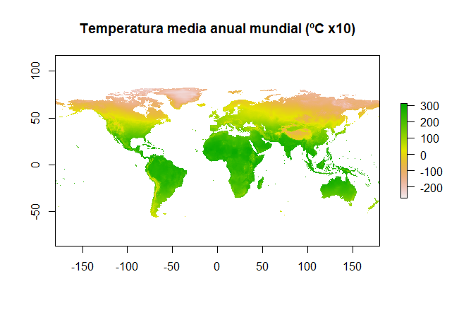

Los datos se descargan en formato raster. Ahora hay que seleccionar los datos correspondientes a la Península Ibérica. Realizamos la selección recortando el cuadrado en el cual se comprende la peninsula. 
```{r}
#Recortamos con extent los grados de longitud y latitud que emarcan la peninsula iberica
e <- extent(-10,4,36,44) #definimos el marco
s.crop <- crop(worldata, e) #Recortamos el worlddata con el extent
plot (s.crop$bio1,
   main = "Mapa de la variable BIO1 en la Península Ibérica",
   xlab = "Longitud (∫C)",
   ylab = "Latitud (∫C)")
```
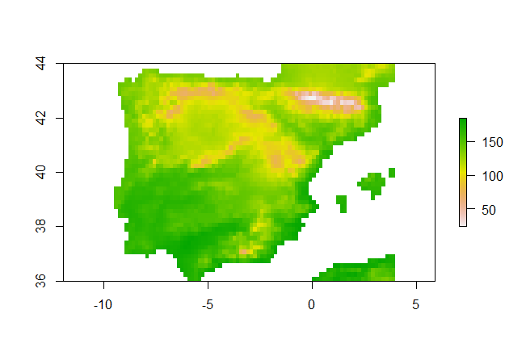

Para sacar los valores dentro del archivo `s.crop` que esta en raster, usamos la funcion as.matrix del paquete raster que saca todos los valores y despues lo convertimos en data frame, definiendo los nombres de las variables:

```{r}
a<-as.matrix(s.crop) #Es una matriz de 19 variables, nos faltan las coordenadas de cada punto, aunque no son esenciales. 
marcoclim <- as.data.frame(a)
names(marcoclim) <- c("BIO1", "BIO2", "BIO3", "BIO4", "BIO5", "BIO6", "BIO7", "BIO8", "BIO9",
                 "BIO10", "BIO11", "BIO12", "BIO13", "BIO14", "BIO15", "BIO16", "BIO17", "BIO18", "BIO19")
```

Exportamos los datos

```{r}
write.csv(marcoclim, file="SpanishRiskAssesment/Datos/MarcoClim2.5.csv") #Guardamos los datos
```


!!!!!!!!! PARA REEMPRENDER DESDE AQUÍ, CARGA LOS DATOS !!!!!!!!!!!
```{r}
marcoclim<- read_csv("SpanishRiskAssesment/Datos/MarcoClim2.5.csv", 
    col_types = cols(X1 = col_skip()))

View(marcoclim)
```

Antes de continuar trabajando, necesitamos hacernos una idea de cómo son los datos, para ello realizamos un pequeño análisis exploratorio y data wrangling
```{r}
library(DataExplorer)
marcoclim <- marcoclim[complete.cases(marcoclim),] # Elimina NA
summary(marcoclim) #resumen de cada variable
plot_str(marcoclim) #estructura de los datos
plot_histogram(marcoclim) 
cor(marcoclim) # Idea de la correlacion de unas variables con otras
plot_correlation(marcoclim) #para visualizar mejor la correlación.
```
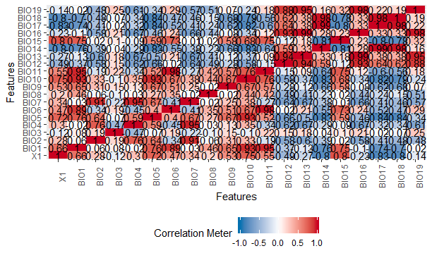


Ahora, podemos representar los datos obtenidos, dependiendo de las variables que nos interesa mostrar:

Para generar un gráfico con temperatura y precipitación

```{r, fig.cap= "Temperatura y Precipitación en la Península Ibérica"}
plot(marcoclim$BIO1~marcoclim$BIO12, pch=19, col="lightblue", xlab="Precipitacion Anual (mm)", ylab="Temperatura anual media (ºC x10)") #ploteamos temperatura media anual y precipitacion anual)

```
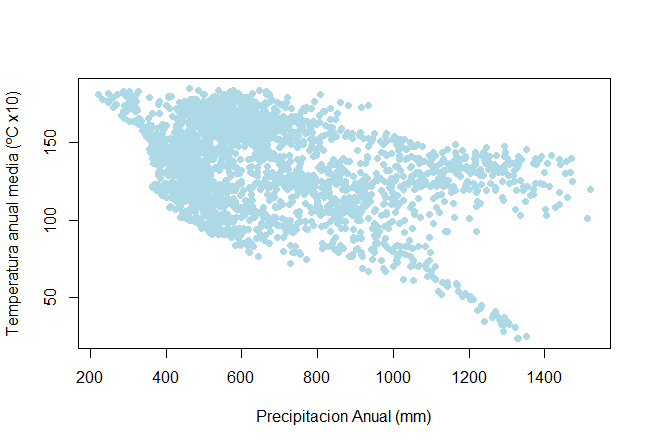

Para generar un gr√°fico de densidad:
```{r, fig.cap = "Grafico de densidad de Temperatura y Precipitación en la Península Ibérica"}
str(marcoclim)
plot(marcoclim$BIO12 ~ marcoclim$BIO1, col = "blue")
d <- density(marcoclim$BIO1) # returns the density data 
plot(d)

dens <- kde2d(marcoclim$BIO1, marcoclim$BIO12, n=300, lims = c(0,200,0,1400))
image(dens)
filled.contour(dens,
               color.palette=colorRampPalette(c('gray94','blue','yellow','red','darkred')),
               xlab= "Annual Mean Temperature (ºC)",
               ylab= "Annual Precipitation (mm)", main = "Marco Climático Ibérico")

```
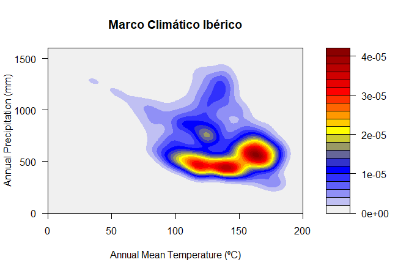


# 4. DESCARTAR VARIABLES MUY CORRELACIONADAS (opcional)
Al trabajar con 19 varaibles, algunas producto lineal de otras, estamos trabajando con información redundante. Podemos basarnos en el criterio VIF (factores de inflación de varianza), un enfoque simple para identificar la colinealidad entre las variables explicativas para descartar algunas y probar el modelo mas adelante con todas las variables y con solo las seleccionadas. 

Esto se describe en : https://www.r-bloggers.com/collinearity-and-stepwise-vif-selection/

Defnimos la funcion de calculo y seleccion de variables con el VIF
```{r}
vif_func<-function(in_frame,thresh=10,trace=T,...){
  
  library(fmsb)
  
  if(any(!'data.frame' %in% class(in_frame))) in_frame<-data.frame(in_frame)
  
  #get initial vif value for all comparisons of variables
  vif_init<-NULL
  var_names <- names(in_frame)
  for(val in var_names){
    regressors <- var_names[-which(var_names == val)]
    form <- paste(regressors, collapse = '+')
    form_in <- formula(paste(val, '~', form))
    vif_init<-rbind(vif_init, c(val, VIF(lm(form_in, data = in_frame, ...))))
  }
  vif_max<-max(as.numeric(vif_init[,2]), na.rm = TRUE)
  
  if(vif_max < thresh){
    if(trace==T){ #print output of each iteration
      prmatrix(vif_init,collab=c('var','vif'),rowlab=rep('',nrow(vif_init)),quote=F)
      cat('\n')
      cat(paste('All variables have VIF < ', thresh,', max VIF ',round(vif_max,2), sep=''),'\n\n')
    }
    return(var_names)
  }
  else{
    
    in_dat<-in_frame
    
    #backwards selection of explanatory variables, stops when all VIF values are below 'thresh'
    while(vif_max >= thresh){
      
      vif_vals<-NULL
      var_names <- names(in_dat)
      
      for(val in var_names){
        regressors <- var_names[-which(var_names == val)]
        form <- paste(regressors, collapse = '+')
        form_in <- formula(paste(val, '~', form))
        vif_add<-VIF(lm(form_in, data = in_dat, ...))
        vif_vals<-rbind(vif_vals,c(val,vif_add))
      }
      max_row<-which(vif_vals[,2] == max(as.numeric(vif_vals[,2]), na.rm = TRUE))[1]
      
      vif_max<-as.numeric(vif_vals[max_row,2])
      
      if(vif_max<thresh) break
      
      if(trace==T){ #print output of each iteration
        prmatrix(vif_vals,collab=c('var','vif'),rowlab=rep('',nrow(vif_vals)),quote=F)
        cat('\n')
        cat('removed: ',vif_vals[max_row,1],vif_max,'\n\n')
        flush.console()
      }
      
      in_dat<-in_dat[,!names(in_dat) %in% vif_vals[max_row,1]]
      
    }
    
    return(names(in_dat))
    
  }
  
}
```

Aplicamos la funcion a los datos
```{r}
vif_func(in_frame=marcoclim1,thresh=5,trace=T) # La funcion va calculando los VIF cada vez que quita el que tiene mayor valor hasta quedarnos con valores de VIF por debajo del umbral (hemos puesto 5, pero podria ser otro)
```


# 5. REDUCCIÓN DE DIMENSIONES POR PCA
PAra describir de forma reducida el marco climático Ibérico realizamos una reducción de dimensiones por Analisis de Componentes principales:

Cargamos los datos
```{r}
marcoclim<- read_csv("SpanishRiskAssesment/Datos/MarcoClim2.5.csv", 
    col_types = cols(X1 = col_skip()))

View(marcoclim)
marcoclim <- marcoclim[complete.cases(marcoclim),] # Elimina NA

```

PCA con todos los datos:
```{r}
pcaclim <- prcomp(marcoclim, center = TRUE, scale. = TRUE) 
print(pcaclim)
plot(pcaclim, type = "l")
summary(pcaclim)
plot(pcaclim$x[,1],pcaclim$x[,2], col = "lightblue")
```
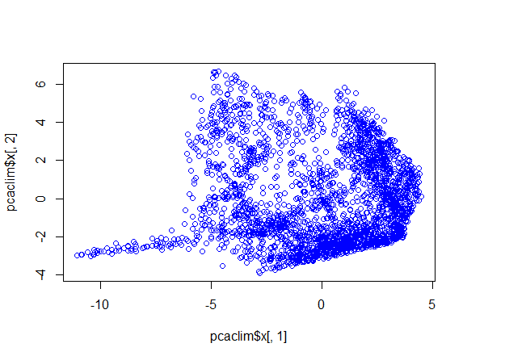

Se explica un 75,42% de la variabilidad con el componente principal 1 y 2. Nos parece suficiente para continuar. 


PCA solo con las variables que VIF < 5
```{r}
marcoclimVIF <- marcoclim[,c(2,3,8,9,13,15)]

pcaclim2 <- prcomp(marcoclimVIF, center = TRUE, scale. = TRUE) 
print(pcaclim2)
plot(pcaclim2, type = "l")
summary(pcaclim2)
```

Otro plot interesante, es por ejemplo, la contribucion de cada una de las variables en el an√°lisis de componentes principales.
```{r}
fviz_pca_var(pcaclim,
             col.var = "contrib", # Color by contributions to the PC
             gradient.cols = c("#00AFBB", "#E7B800", "#FC4E07"),
             repel = TRUE     # Avoid text overlapping
)  ##Función para ver la contribución de cada variable en esta PCA

## Manera de representar la PCA extraído de https://tgmstat.wordpress.com/2013/11/28/computing-and-visualizing-pca-in-r/

g <- ggbiplot(pcaclim, obs.scale = 1, var.scale = 1, 
               ellipse = TRUE, alpha=0.1, 
              circle = TRUE)
g <- g + scale_color_discrete(name = '')
g <- g + theme(legend.direction = 'horizontal', 
               legend.position = 'top')
print(g)
```
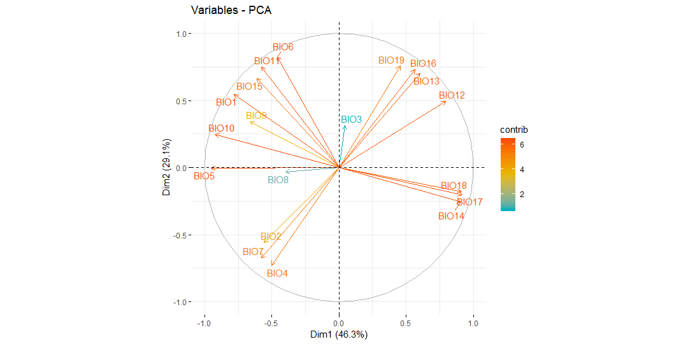

# 6. OBTENCIÓN DE DATOS DE OTROS PAISES Y PROYECCIÓN SOBRE EL MARCO CLIMÁTICO IBÉRICO
Pretendemos evaluar país por país, si sus condiciones climáticas se parecen a las de la península ibérica, con el fin de determinar después especies que podrían encontrar condiciones favorables en nuestro país actuando como invasoras. Por eso proyectamos los datos de marco climático de estos países sobre el nuestro.

Cargamos los datos del marco climatico ibérico:
```{r}
marcoclim<- read_csv("SpanishRiskAssesment/Datos/MarcoClim2.5.csv", 
    col_types = cols(X1 = col_skip()))

View(marcoclim)
marcoclim <- marcoclim[complete.cases(marcoclim),] # Elimina NA

```

Preparamos los datos de la Peninsula Ibérica de los dos primeros componentes:
```{r}
e <- pcaclim$x[,1:2]
edf <- as.data.frame(e)
edf$pais <- "Spain" #Añadimos una varaible de Pais, con todas las etiquetes "Spain"
```


Descargamos los datos del WordClim (ya hecho previamente en el #3)
```{r}
#Download the WorldClim Data
worldata <- getData("worldclim",var="bio", res=2.5)
plot(worldata$bio1, main =  "Temperatura media anual mundial (ºC x10)")
```

En: https://www.gis-blog.com/r-raster-data-acquisition, encontramos como se realiza la descarga y recorte de los paises. Para llamar a un pais concreto se usa la nomenclatura de tres letras definida en: http://kirste.userpage.fu-berlin.de/diverse/doc/ISO_3166.html. Hay una base de datos con los nombres y codigos de los 241 paises que incluye la lista. Podemos importar esos datos:
```{r}
CountryCodes <- read_delim("SpanishRiskAssesment/Datos/CountryCodes.csv", 
    ";", escape_double = FALSE, trim_ws = TRUE)

#A3 son los codigos para descargar el pais
```


Descargamos los limites politicos de un pais con la función:
```{r}
denmark <- getData('GADM', country='DNK', level=0)
plot(denmark)
s<- crop(worldata, denmark)
s2 <- mask(s, denmark)
s2<-as.matrix(s2)
marcoclim.denmark <- as.data.frame(s2)
names(marcoclim.denmark) <- c("BIO1","BIO2","BIO3","BIO4", "BIO5", "BIO6", "BIO7", "BIO8", "BIO9",
                 "BIO10","BIO11","BIO12","BIO13", "BIO14", "BIO15", "BIO16", "BIO17", "BIO18", "BIO19")

marcoclim.denmark <- marcoclim.denmark[complete.cases(marcoclim.denmark),]

```
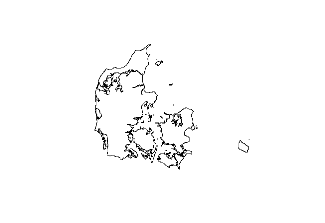


Proyectamos estos valores sobre el PCA del marco climatico ibérico
```{r}
i <- predict (pcaclim, newdata = marcoclim.denmark) 
i <- i[,1:2]

idf <- as.data.frame(i) 
idf$pais <- "Din" #Generamos la variable pais, con el nombre de la etiqueta del mismo.

df <- rbind(edf,idf) #Combinamos los dos data frames, con los datos de PC1 y 2 de españa y el pais seleccionado

```


Generamos un gr√°fico para visualizar el grado de solapamiento de ambas nubes de puntos:

```{r}
ggplot(df, aes(x=PC1, y=PC2, col=pais)) + geom_point()

```
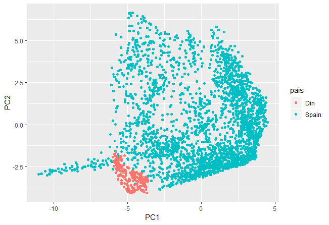

Solapamos dos gr√°ficos de densidad para visualizar el grado de solapamiento de ambas nubes de puntos:
```{r}
# PARA HACER UN SOLO GRAFICO DE DENSIDAD CON TODOS LOS DATOS SERIA ASÍ
dens <- kde2d(df$PC1, df$PC2, n=300, lims = c(-20,10,-10,10))
image(dens)
filled.contour(dens,
               color.palette=colorRampPalette(c('gray94','blue','yellow','red','darkred')),
               xlab= "PC1",
               ylab= "PC2", main = "Contraste de marcos climaticos")

# AHORA SOLO ESPAÑA:
dense <- kde2d(edf$PC1, edf$PC2, n=300, lims = c(-12,7,-10,10))
image(dense)
filled.contour(dense,
               color.palette=colorRampPalette(c('gray94','blue','yellow','red','darkred')),
               xlab= "PC1",
               ylab= "PC2", main = "Marco climático Ibérico")

#AHORA SOLO EL PAIS PROYECTADO:
densi <- kde2d(idf$PC1, idf$PC2, n=300, lims = c(-12,7,-10,10))
image(densi)
filled.contour(densi,
               color.palette=colorRampPalette(c('gray94','blue','yellow','red','darkred')),
               xlab= "PC1",
               ylab= "PC2", main = "Marco climático Ibérico del pais proyectado")


#Como se ponen los dos juntos??


```
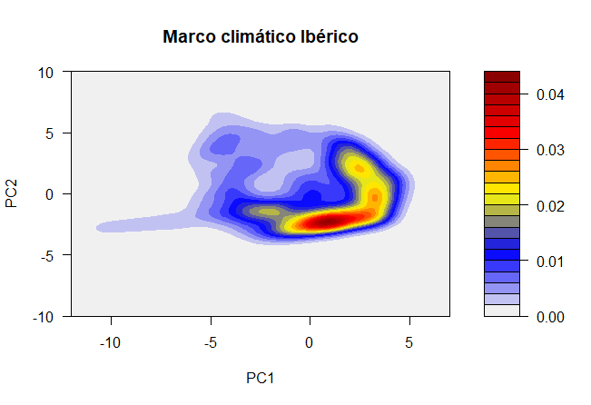
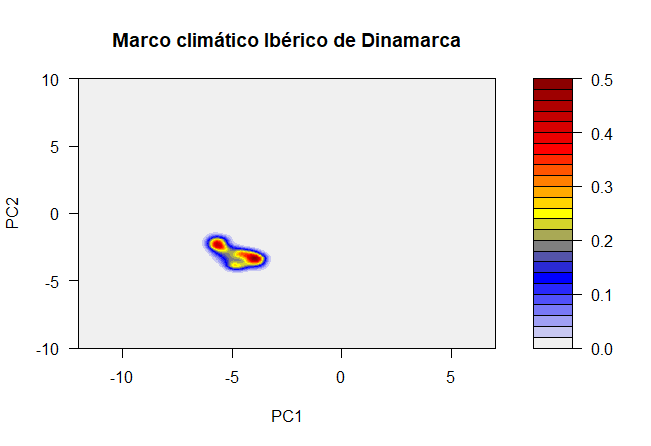


# 7. DETERMINACIÓN DEL RIESGO INVASOR
Queremos cuantificar el grado de solapamiento de las nubes de puntos descritas por los puntos de los dos paises, el receptor (España) y el proyectado.
Hay que crear ciertos metricos para la determinación de el grado de riesgo de invasión. 


# 7.1. Significación por Bootstraping
Realizar una ANOVA con permutaciones por Bootstraping: contraste de la distribución de etiquetas a l'azar con la distribución real de etiquetas. ¿La assignación podria haber sido al azar?
Si el resultado resulta significativo, hay diferenciación del espacio climatico y por lo tanto las especies del pais proyectado no podrian sobrevivir en España. 

COMO HACERLO EN R??  PENDIENTE


# 7.2.Significación por Test de Permutación

# 7.3. Grado de solapamiento desde el receptor y desde el proyectado

PENDIENTE


# 7.4. Otros?

PENDIENTE


# 8. OBTENCION DATOS DE ESPECIES INVASORAS MUNDIALES. ORIGEN Y PRESENCIA

Turbelin et al. 2017, utilizan datos de http://www.iucngisd.org/gisd/ y de https://www.cabi.org/isc/. para determinar los patrones de distribucion de especies invasoras, en CABI existen datasets de cada una de las especies exóticas invasoras. Descargamos estos datos para una lista de plantas, recogen país donde la planta está presente, latitud longitud, si es nativa o introducida, etc.  Los uniremos entre si? . 

# 9. BIBLIOGRAFÍA

##SITIOS WEB

https://worldclim.org/bioclim
https://www.cabi.org/isc/.
https://www.r-bloggers.com/collinearity-and-stepwise-vif-selection/
https://tgmstat.wordpress.com/2013/11/28/computing-and-visualizing-pca-in-r/
https://www.gis-blog.com/r-raster-data-acquisition http://kirste.userpage.fu-berlin.de/diverse/doc/ISO_3166.html.
https://stackoverflow.com/questions/31272695/calculate-probability-of-point-on-2d-density-surface
https://rstudio-pubs-static.s3.amazonaws.com/330387_5a40ca72c3b14824acedceb7d34618d1.html

https://stats.stackexchange.com/questions/63447/integrating-kernel-density-estimator-in-2d
##ARTICULOS Y LIBROS

Turbelin, Anna J., Malamud, Bruce D., Francis, Robert A.Mapping the global state of invasive alien species: patterns of invasion and policy responses.*Global Ecology & Biogeography*, September 2016.

Davison, A. C. & Hinkley, D. V. (1997) Bootstrap Methods and Their Applications. Cambridge University Press, Cambridge. ISBN 0-521-57391-2

